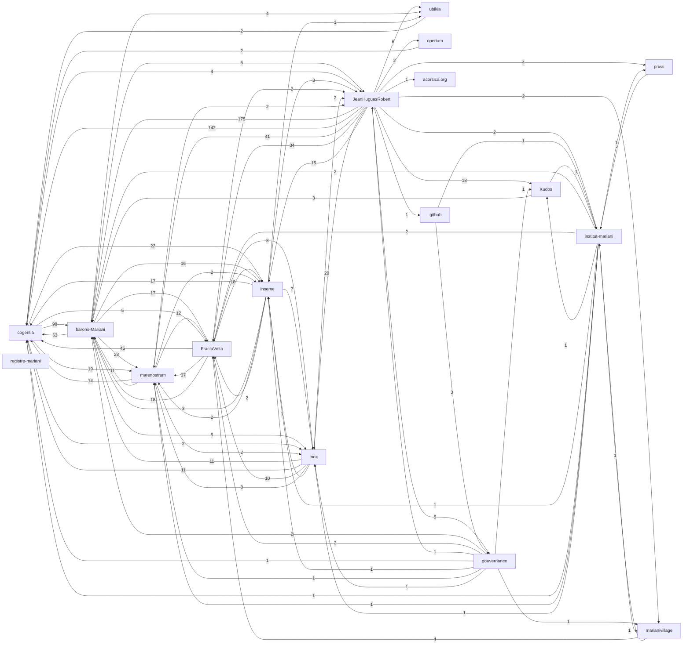

# Corpus Status - privai

## Registered Repositories
<!-- BEGIN_AUTO: registered_repos -->
| Repository | research/index.md | Branch | Policy | Visibility | Public presence |
|---|---|---|---|---|---|
| cogentia | yes | main | all | public | full |
| FractaVolta | yes | main | all | public | full |
| marenostrum | yes | main | all | public | full |
| barons-Mariani | yes | main | all | public | full |
| inseme | yes | main | research | public | full |
| Inox | yes | master | all | public | full |
| registre-mariani | yes | main | all | private | stub |
| ubikia | yes | main | all | public | full |
| operium | yes | main | all | public | full |
| JeanHuguesRobert | yes | main | all | public | full |
| privai | yes | main | all | public | full |
| gouvernance | yes | main | all | public | full |
| marianivillage | yes | main | all | public | full |
| institut-mariani | yes | main | all | public | full |
| Kudos | yes | main | all | public | full |
| .github | yes | main | all | public | full |
| acorsica.org | yes | main | all | public | full |
<!-- END_AUTO: registered_repos -->
---

## Cross-Reference Graph
<!-- BEGIN_AUTO: graph -->

<!-- END_AUTO: graph -->
---

## Concepts
<!-- BEGIN_AUTO: concepts -->
*(No concepts registered.)*
<!-- END_AUTO: concepts -->
## Concept Graph
<!-- BEGIN_AUTO: concept_graph -->
```mermaid
graph LR
  c_civilizational_stakes["Civilizational Stakes"]
  c_machine_a_explorer["Machine à explorer"]
  c_machine_a_empecher["Machine à empêcher"]
  c_effet_ubik["Effet Ubik"]
  c_stabilisateurs_anti_ubik_proceduraux["Stabilisateurs (anti-Ubik / procéduraux)"]
  c_cogentia["Cogentia"]
  c_cogentigram["Cogentigram"]
  c_continuation_protocol["Continuation Protocol"]
  c_non_deterministic_cognitive_step_agentic_step["Non-deterministic Cognitive Step (Agentic Step)"]
  c_human_enacted_decision_artifact["Human Enacted Decision Artifact"]
  c_causal_trace_replay_auditable_causal_reconstruction["Causal Trace Replay (Auditable Causal Reconstruction)"]
  c_cognitive_packet["Cognitive Packet"]
  c_cogentia_commons["Cogentia Commons"]
  c_cogentia_pipeline["Cogentia Pipeline"]
  c_derived_product["Derived Product"]
  c_sovereign_digital_twin["Sovereign Digital Twin"]
  c_agent_resumable_cli["Agent-Resumable CLI"]
  c_kernel_extractor["Kernel Extractor"]
  c_kys_know_your_system_psychocognitive_analysis["KYS (Know Your System) / Psychocognitive Analysis"]
  c_cogentia_workflows["Cogentia Workflows"]
  c_cogentia["Cogentia"]
  c_cogentigram["Cogentigram"]
  c_ipn_inference_packet_network["IPN (Inference Packet Network)"]
  c_epn_energy_packet_network["EPN (Energy Packet Network)"]
  c_pgn_power_generation_node["PGN (Power Generation Node)"]
  c_packet_attractors["Packet Attractors"]
  c_the_unconscious_grid["The Unconscious Grid"]
  c_mariani_village["Mariani Village"]
  c_value_shaped_solar["Value-Shaped Solar"]
  c_containerized_compute_tera["Containerized Compute (Tera)"]
  c_traceable_governance["Traceable Governance"]
  c_cogentia["Cogentia"]
  c_cogentigram["Cogentigram"]
  c_dhitl_democratic_human_in_the_loop["DHITL (Democratic Human In The Loop)"]
  c_cxu_compute_and_exergy_unit["CXU (Compute and Exergy Unit)"]
  c_safe_compute_exergy["Safe Compute Exergy"]
  c_constellia["Constellia"]
  c_corsica_forest_synergies["Corsica Forest Synergies"]
  c_infrastructure_is_all_you_need["Infrastructure is All You Need"]
  c_sun_to_sovereignty["Sun to Sovereignty"]
  c_civilizational_stakes["Civilizational Stakes"]
  c_machine_a_explorer["Machine à explorer"]
  c_machine_a_empecher["Machine à empêcher"]
  c_effet_ubik["Effet Ubik"]
  c_stabilisateurs_anti_ubik_proceduraux["Stabilisateurs (anti-Ubik / procéduraux)"]
  c_cogentia["Cogentia"]
  c_cogentigram["Cogentigram"]
  c_potentics["Potentics"]
  c_cognitive_waves["Cognitive Waves"]
  c_mimetic_desynchronization["Mimetic Desynchronization"]
  c_invidia["Invidia"]
  c_transition_markets["Transition Markets"]
  c_the_uchronian_museum["The Uchronian Museum"]
  c_possibilism["Possibilism"]
  c_territoires_possibilistes["Territoires Possibilistes"]
  c_autonomie_de_capacite["Autonomie de capacité"]
  c_kudocracy["Kudocracy"]
  c_kudos["Kudos"]
  c_pathologie_du_secret["Pathologie du secret"]
  c_the_second_method["The Second Method"]
  c_projet_minesteggio["Projet Minesteggio"]
  c_discret_holography["Discret Holography"]
  c_cogentia["Cogentia"]
  c_cogentigram["Cogentigram"]
  c_cop_continuous_operation_protocol["COP (Continuous Operation Protocol)"]
  c_briques["Briques"]
  c_kudocracy["Kudocracy"]
  c_agora["Agora"]
  c_ophelia["Ophélia"]
  c_cop_invariants["COP Invariants"]
  c_non_deterministic_cognitive_step_agentic_step["Non-deterministic Cognitive Step (Agentic Step)"]
  c_human_enacted_decision_artifact["Human Enacted Decision Artifact"]
  c_causal_trace_replay_auditable_causal_reconstruction["Causal Trace Replay (Auditable Causal Reconstruction)"]
  c_cop_cognitive_orchestration_protocol["COP (Cognitive Orchestration Protocol)"]
  c_brique_spec_multi_instance["Brique Spec / Multi-Instance"]
  c_modular_system["Modular System"]
  c_concatenative_language["Concatenative language"]
  c_stack_vm["Stack VM"]
  c_control_data_plane_separation["Control/data plane separation"]
  c_named_values["Named values"]
  c_reactive_sets["Reactive sets"]
  c_actors["Actors"]
  c_dialects["Dialects"]
  c_fractanet["Fractanet"]
  c_cogentia["Cogentia"]
  c_cogentigram["Cogentigram"]
  c_possibilism --> c_machine_a_explorer
  c_democratic_ai_safety --> c_machine_a_explorer
  c_machine_a_explorer --> c_cogentia_commons_declinaison_manuelle
  c_machine_a_explorer --> c_fractanet_cop_declinaison_automatisee
  c_machine_a_explorer --> c_stabilisateurs_anti_ubik
  c_machine_a_explorer -.-> c_continuation_protocol
  c_machine_a_explorer -.-> c_cognitive_packet
  c_machine_a_explorer -.-> c_dhitl_couches_4_5
  c_machine_a_explorer -.-> c_effet_ubik_oppose
  c_machine_a_empecher -.-> c_effet_ubik
  c_machine_a_empecher -.-> c_machine_a_explorer_oppose_symetrique
  c_machine_a_empecher -.-> c_fm_11_outer_optimizer_capture
  c_machine_a_empecher -.-> c_concentration_de_compute_85_frontier
  c_machine_a_empecher --> c_effet_ubik
  c_effet_ubik -.-> c_stabilisateurs_anti_ubik
  c_effet_ubik -.-> c_pathologie_du_secret
  c_effet_ubik -.-> c_invidia_densite_sociale_destructrice
  c_machine_a_explorer --> c_stabilisateurs_anti_ubik_proceduraux
  c_stabilisateurs_anti_ubik_proceduraux -.-> c_effet_ubik
  c_stabilisateurs_anti_ubik_proceduraux -.-> c_continuation_protocol
  c_stabilisateurs_anti_ubik_proceduraux -.-> c_cognitive_packet
  c_stabilisateurs_anti_ubik_proceduraux -.-> c_dhitl_compute_exergy_comme_unite_tracable
  c_cogentia --> c_cogentigram
  c_cogentigram -.-> c_map_vs_territory
  c_cogentigram -.-> c_operational_memory
  c_cogentigram -.-> c_traceable_agency
  c_agent_resumable_cli --> c_continuation_protocol
  c_machine_a_explorer --> c_continuation_protocol
  c_continuation_protocol -.-> c_non_deterministic_cognitive_step
  c_continuation_protocol -.-> c_human_enacted_decision_artifact
  c_continuation_protocol -.-> c_causal_trace_replay
  c_machine_a_explorer --> c_non_deterministic_cognitive_step_agentic_step
  c_non_deterministic_cognitive_step_agentic_step -.-> c_human_enacted_decision_artifact
  c_non_deterministic_cognitive_step_agentic_step -.-> c_causal_trace_replay
  c_non_deterministic_cognitive_step_agentic_step -.-> c_continuation_protocol
  c_machine_a_explorer --> c_human_enacted_decision_artifact
  c_cop_hitl_profile --> c_human_enacted_decision_artifact
  c_human_enacted_decision_artifact -.-> c_non_deterministic_cognitive_step
  c_human_enacted_decision_artifact -.-> c_rule_0_seconde_methode
  c_human_enacted_decision_artifact -.-> c_dhitl_layer_5
  c_cop_invariants --> c_causal_trace_replay_auditable_causal_reconstruction
  c_machine_a_explorer --> c_causal_trace_replay_auditable_causal_reconstruction
  c_causal_trace_replay_auditable_causal_reconstruction -.-> c_continuation_protocol
  c_causal_trace_replay_auditable_causal_reconstruction -.-> c_non_deterministic_cognitive_step
  c_continuation_protocol --> c_cognitive_packet
  c_agent_resumable_cli --> c_cognitive_packet
  c_cognitive_packet --> c_envelope_kind_agnostic_metadata_layer
  c_cognitive_packet --> c_payload_kind_specific_content_layer
  c_cognitive_packet --> c_continuation_payload
  c_cognitive_packet --> c_objection_payload
  c_cognitive_packet --> c_hypothesis_payload
  c_cognitive_packet --> c_decision_payload
  c_cognitive_packet --> c_failure_payload
  c_cognitive_packet --> c_routing_payload
  c_cognitive_packet -.-> c_cogentia_commons
  c_cogentia_commons --> c_cogentia_pipeline
  c_cognitive_packet --> c_cogentia_pipeline
  c_cogentia_pipeline --> c_source_document
  c_cogentia_pipeline --> c_derived_product
  c_cogentia_pipeline --> c_derived_product
  c_derived_product -.-> c_source_document
  c_traceable_agency --> c_cogentia
  c_cogentia --> c_cogentigram
  c_cogentia --> c_operational_memory
  c_cogentia --> c_cogentigram
  c_cogentigram -.-> c_map_vs_territory
  c_cogentigram -.-> c_operational_memory
  c_cogentigram -.-> c_traceable_agency
  c_traceable_agency --> c_cogentia
  c_cogentia --> c_cogentigram
  c_cogentia --> c_operational_memory
  c_cogentia --> c_cogentigram
  c_cogentigram -.-> c_map_vs_territory
  c_cogentigram -.-> c_operational_memory
  c_cogentigram -.-> c_traceable_agency
  c_dhitl --> c_infrastructure_is_all_you_need
  c_possibilism --> c_machine_a_explorer
  c_democratic_ai_safety --> c_machine_a_explorer
  c_machine_a_explorer --> c_cogentia_commons_declinaison_manuelle
  c_machine_a_explorer --> c_fractanet_cop_declinaison_automatisee
  c_machine_a_explorer --> c_stabilisateurs_anti_ubik
  c_machine_a_explorer -.-> c_continuation_protocol
  c_machine_a_explorer -.-> c_cognitive_packet
  c_machine_a_explorer -.-> c_dhitl_couches_4_5
  c_machine_a_explorer -.-> c_effet_ubik_oppose
  c_machine_a_empecher -.-> c_effet_ubik
  c_machine_a_empecher -.-> c_machine_a_explorer_oppose_symetrique
  c_machine_a_empecher -.-> c_fm_11_outer_optimizer_capture
  c_machine_a_empecher -.-> c_concentration_de_compute_85_frontier
  c_machine_a_empecher --> c_effet_ubik
  c_effet_ubik -.-> c_stabilisateurs_anti_ubik
  c_effet_ubik -.-> c_pathologie_du_secret
  c_effet_ubik -.-> c_invidia_densite_sociale_destructrice
  c_machine_a_explorer --> c_stabilisateurs_anti_ubik_proceduraux
  c_stabilisateurs_anti_ubik_proceduraux -.-> c_effet_ubik
  c_stabilisateurs_anti_ubik_proceduraux -.-> c_continuation_protocol
  c_stabilisateurs_anti_ubik_proceduraux -.-> c_cognitive_packet
  c_stabilisateurs_anti_ubik_proceduraux -.-> c_dhitl_compute_exergy_comme_unite_tracable
  c_cogentia --> c_cogentigram
  c_cogentigram -.-> c_map_vs_territory
  c_cogentigram -.-> c_operational_memory
  c_cogentigram -.-> c_traceable_agency
  c_possibilism --> c_autonomie_de_capacite
  c_capabilities_approach_sen_nussbaum --> c_autonomie_de_capacite
  c_autonomie_de_capacite --> c_specificite_de_phase
  c_autonomie_de_capacite --> c_flexibilite_d_usage_redistributive_vs_predatory
  c_autonomie_de_capacite -.-> c_territoires_possibilistes
  c_autonomie_de_capacite -.-> c_auto_institution_democratique_castoriadis
  c_possibilism --> c_kudocracy
  c_auto_institution_democratique_castoriadis --> c_kudocracy
  c_kudocracy -.-> c_autonomie_de_capacite
  c_kudocracy -.-> c_kudos
  c_kudocracy -.-> c_pathologie_du_secret
  c_kudocracy -.-> c_cognitive_packet
  c_possibilism --> c_kudos
  c_communs_ostrom --> c_kudos
  c_kudos -.-> c_kudocracy
  c_kudos -.-> c_autonomie_de_capacite
  c_kudos -.-> c_mauss_gift_counter_gift
  c_democratic_ai_safety_thesis_kernel --> c_pathologie_du_secret
  c_the_second_method --> c_pathologie_du_secret
  c_pathologie_du_secret -.-> c_dhitl_democratic_humans_in_the_loop
  c_pathologie_du_secret -.-> c_cogentia_commons_auditable_knowledge
  c_pathologie_du_secret -.-> c_tracabilite_civique_anti_mafieuse
  c_possibilism --> c_projet_minesteggio
  c_machine_a_explorer --> c_projet_minesteggio
  c_autonomie_de_capacite --> c_projet_minesteggio
  c_the_uchronian_museum --> c_projet_minesteggio
  c_projet_minesteggio --> c_museologie_capacitaire
  c_projet_minesteggio --> c_indice_de_friction_administrative
  c_projet_minesteggio --> c_indice_de_capacite_retrouvee
  c_projet_minesteggio --> c_grille_de_remise_en_service
  c_projet_minesteggio -.-> c_machine_a_empecher
  c_projet_minesteggio -.-> c_stabilisateurs_anti_ubik_proceduraux
  c_projet_minesteggio -.-> c_projet_minesteggio
  c_projet_minesteggio -.-> c_the_second_method
  c_projet_minesteggio -.-> c_kudos
  c_traceable_agency --> c_cogentia
  c_cogentia --> c_cogentigram
  c_cogentia --> c_operational_memory
  c_cogentia --> c_cogentigram
  c_cogentigram -.-> c_map_vs_territory
  c_cogentigram -.-> c_operational_memory
  c_cogentigram -.-> c_traceable_agency
  c_machine_a_explorer --> c_cop_invariants
  c_stabilisateurs_anti_ubik_proceduraux --> c_cop_invariants
  c_machine_a_explorer --> c_non_deterministic_cognitive_step_agentic_step
  c_non_deterministic_cognitive_step_agentic_step -.-> c_human_enacted_decision_artifact
  c_non_deterministic_cognitive_step_agentic_step -.-> c_causal_trace_replay
  c_machine_a_explorer --> c_human_enacted_decision_artifact
  c_cop_hitl_profile --> c_human_enacted_decision_artifact
  c_human_enacted_decision_artifact -.-> c_non_deterministic_cognitive_step
  c_human_enacted_decision_artifact -.-> c_rule_0_seconde_methode
  c_human_enacted_decision_artifact -.-> c_dhitl_layer_5
  c_cop_invariants --> c_causal_trace_replay_auditable_causal_reconstruction
  c_machine_a_explorer --> c_causal_trace_replay_auditable_causal_reconstruction
  c_causal_trace_replay_auditable_causal_reconstruction -.-> c_deterministic_replay_protocol_layer_only
  c_causal_trace_replay_auditable_causal_reconstruction -.-> c_non_deterministic_cognitive_step
  c_concatenative_language -.-> c_stack_vm
  c_concatenative_language -.-> c_named_values
  c_stack_vm -.-> c_concatenative_language
  c_stack_vm -.-> c_control_data_plane_separation
  c_stack_vm -.-> c_named_values
  c_stack_vm --> c_control_data_plane_separation
  c_control_data_plane_separation -.-> c_energy_packet_network_fractavolta
  c_control_data_plane_separation -.-> c_cognitive_packet_envelope_payload_cogentia
  c_stack_vm --> c_named_values
  c_fractanet -.-> c_energy_packet_network_fractavolta
  c_fractanet -.-> c_auxilia_inseme_brique_human_scale_fractanet_exchange
  c_fractanet -.-> c_actors
  c_traceable_agency --> c_cogentia
  c_cogentia --> c_cogentigram
  c_cogentia --> c_operational_memory
  c_cogentia --> c_cogentigram
  c_cogentigram -.-> c_map_vs_territory
  c_cogentigram -.-> c_operational_memory
  c_cogentigram -.-> c_traceable_agency
  click c_civilizational_stakes "https://github.com/JeanHuguesRobert/cogentia/blob/main/research/concepts.md#civilizational-stakes" "Open Civilizational Stakes"
  click c_machine_a_explorer "https://github.com/JeanHuguesRobert/cogentia/blob/main/research/concepts.md#machine-a-explorer" "Open Machine à explorer"
  click c_machine_a_empecher "https://github.com/JeanHuguesRobert/cogentia/blob/main/research/concepts.md#machine-a-empecher" "Open Machine à empêcher"
  click c_effet_ubik "https://github.com/JeanHuguesRobert/cogentia/blob/main/research/concepts.md#effet-ubik" "Open Effet Ubik"
  click c_stabilisateurs_anti_ubik_proceduraux "https://github.com/JeanHuguesRobert/cogentia/blob/main/research/concepts.md#stabilisateurs-anti-ubik-proceduraux" "Open Stabilisateurs (anti-Ubik / procéduraux)"
  click c_cogentia "https://github.com/JeanHuguesRobert/cogentia/blob/main/research/concepts.md#cogentia" "Open Cogentia"
  click c_cogentigram "https://github.com/JeanHuguesRobert/cogentia/blob/main/research/concepts.md#cogentigram" "Open Cogentigram"
  click c_continuation_protocol "https://github.com/JeanHuguesRobert/cogentia/blob/main/research/concepts.md#continuation-protocol" "Open Continuation Protocol"
  click c_non_deterministic_cognitive_step_agentic_step "https://github.com/JeanHuguesRobert/cogentia/blob/main/research/concepts.md#non-deterministic-cognitive-step-agentic-step" "Open Non-deterministic Cognitive Step (Agentic Step)"
  click c_human_enacted_decision_artifact "https://github.com/JeanHuguesRobert/cogentia/blob/main/research/concepts.md#human-enacted-decision-artifact" "Open Human Enacted Decision Artifact"
  click c_causal_trace_replay_auditable_causal_reconstruction "https://github.com/JeanHuguesRobert/cogentia/blob/main/research/concepts.md#causal-trace-replay-auditable-causal-reconstruction" "Open Causal Trace Replay (Auditable Causal Reconstruction)"
  click c_cognitive_packet "https://github.com/JeanHuguesRobert/cogentia/blob/main/research/concepts.md#cognitive-packet" "Open Cognitive Packet"
  click c_cogentia_commons "https://github.com/JeanHuguesRobert/cogentia/blob/main/research/concepts.md#cogentia-commons" "Open Cogentia Commons"
  click c_cogentia_pipeline "https://github.com/JeanHuguesRobert/cogentia/blob/main/research/concepts.md#cogentia-pipeline" "Open Cogentia Pipeline"
  click c_derived_product "https://github.com/JeanHuguesRobert/cogentia/blob/main/research/concepts.md#derived-product" "Open Derived Product"
  click c_sovereign_digital_twin "https://github.com/JeanHuguesRobert/cogentia/blob/main/research/concepts.md#sovereign-digital-twin" "Open Sovereign Digital Twin"
  click c_agent_resumable_cli "https://github.com/JeanHuguesRobert/cogentia/blob/main/research/concepts.md#agent-resumable-cli" "Open Agent-Resumable CLI"
  click c_kernel_extractor "https://github.com/JeanHuguesRobert/cogentia/blob/main/research/concepts.md#kernel-extractor" "Open Kernel Extractor"
  click c_kys_know_your_system_psychocognitive_analysis "https://github.com/JeanHuguesRobert/cogentia/blob/main/research/concepts.md#kys-know-your-system-psychocognitive-analysis" "Open KYS (Know Your System) / Psychocognitive Analysis"
  click c_cogentia_workflows "https://github.com/JeanHuguesRobert/cogentia/blob/main/research/concepts.md#cogentia-workflows" "Open Cogentia Workflows"
  click c_cogentia "https://github.com/JeanHuguesRobert/FractaVolta/blob/main/research/concepts.md#cogentia" "Open Cogentia"
  click c_cogentigram "https://github.com/JeanHuguesRobert/FractaVolta/blob/main/research/concepts.md#cogentigram" "Open Cogentigram"
  click c_ipn_inference_packet_network "https://github.com/JeanHuguesRobert/FractaVolta/blob/main/research/concepts.md#ipn-inference-packet-network" "Open IPN (Inference Packet Network)"
  click c_epn_energy_packet_network "https://github.com/JeanHuguesRobert/FractaVolta/blob/main/research/concepts.md#epn-energy-packet-network" "Open EPN (Energy Packet Network)"
  click c_pgn_power_generation_node "https://github.com/JeanHuguesRobert/FractaVolta/blob/main/research/concepts.md#pgn-power-generation-node" "Open PGN (Power Generation Node)"
  click c_packet_attractors "https://github.com/JeanHuguesRobert/FractaVolta/blob/main/research/concepts.md#packet-attractors" "Open Packet Attractors"
  click c_the_unconscious_grid "https://github.com/JeanHuguesRobert/FractaVolta/blob/main/research/concepts.md#the-unconscious-grid" "Open The Unconscious Grid"
  click c_mariani_village "https://github.com/JeanHuguesRobert/FractaVolta/blob/main/research/concepts.md#mariani-village" "Open Mariani Village"
  click c_value_shaped_solar "https://github.com/JeanHuguesRobert/FractaVolta/blob/main/research/concepts.md#value-shaped-solar" "Open Value-Shaped Solar"
  click c_containerized_compute_tera "https://github.com/JeanHuguesRobert/FractaVolta/blob/main/research/concepts.md#containerized-compute-tera" "Open Containerized Compute (Tera)"
  click c_traceable_governance "https://github.com/JeanHuguesRobert/FractaVolta/blob/main/research/concepts.md#traceable-governance" "Open Traceable Governance"
  click c_cogentia "https://github.com/JeanHuguesRobert/marenostrum/blob/main/research/concepts.md#cogentia" "Open Cogentia"
  click c_cogentigram "https://github.com/JeanHuguesRobert/marenostrum/blob/main/research/concepts.md#cogentigram" "Open Cogentigram"
  click c_dhitl_democratic_human_in_the_loop "https://github.com/JeanHuguesRobert/marenostrum/blob/main/research/concepts.md#dhitl-democratic-human-in-the-loop" "Open DHITL (Democratic Human In The Loop)"
  click c_cxu_compute_and_exergy_unit "https://github.com/JeanHuguesRobert/marenostrum/blob/main/research/concepts.md#cxu-compute-and-exergy-unit" "Open CXU (Compute and Exergy Unit)"
  click c_safe_compute_exergy "https://github.com/JeanHuguesRobert/marenostrum/blob/main/research/concepts.md#safe-compute-exergy" "Open Safe Compute Exergy"
  click c_constellia "https://github.com/JeanHuguesRobert/marenostrum/blob/main/research/concepts.md#constellia" "Open Constellia"
  click c_corsica_forest_synergies "https://github.com/JeanHuguesRobert/marenostrum/blob/main/research/concepts.md#corsica-forest-synergies" "Open Corsica Forest Synergies"
  click c_infrastructure_is_all_you_need "https://github.com/JeanHuguesRobert/marenostrum/blob/main/research/concepts.md#infrastructure-is-all-you-need" "Open Infrastructure is All You Need"
  click c_sun_to_sovereignty "https://github.com/JeanHuguesRobert/marenostrum/blob/main/research/concepts.md#sun-to-sovereignty" "Open Sun to Sovereignty"
  click c_civilizational_stakes "https://github.com/JeanHuguesRobert/barons-Mariani/blob/main/research/concepts.md#civilizational-stakes" "Open Civilizational Stakes"
  click c_machine_a_explorer "https://github.com/JeanHuguesRobert/barons-Mariani/blob/main/research/concepts.md#machine-a-explorer" "Open Machine à explorer"
  click c_machine_a_empecher "https://github.com/JeanHuguesRobert/barons-Mariani/blob/main/research/concepts.md#machine-a-empecher" "Open Machine à empêcher"
  click c_effet_ubik "https://github.com/JeanHuguesRobert/barons-Mariani/blob/main/research/concepts.md#effet-ubik" "Open Effet Ubik"
  click c_stabilisateurs_anti_ubik_proceduraux "https://github.com/JeanHuguesRobert/barons-Mariani/blob/main/research/concepts.md#stabilisateurs-anti-ubik-proceduraux" "Open Stabilisateurs (anti-Ubik / procéduraux)"
  click c_cogentia "https://github.com/JeanHuguesRobert/barons-Mariani/blob/main/research/concepts.md#cogentia" "Open Cogentia"
  click c_cogentigram "https://github.com/JeanHuguesRobert/barons-Mariani/blob/main/research/concepts.md#cogentigram" "Open Cogentigram"
  click c_potentics "https://github.com/JeanHuguesRobert/barons-Mariani/blob/main/research/concepts.md#potentics" "Open Potentics"
  click c_cognitive_waves "https://github.com/JeanHuguesRobert/barons-Mariani/blob/main/research/concepts.md#cognitive-waves" "Open Cognitive Waves"
  click c_mimetic_desynchronization "https://github.com/JeanHuguesRobert/barons-Mariani/blob/main/research/concepts.md#mimetic-desynchronization" "Open Mimetic Desynchronization"
  click c_invidia "https://github.com/JeanHuguesRobert/barons-Mariani/blob/main/research/concepts.md#invidia" "Open Invidia"
  click c_transition_markets "https://github.com/JeanHuguesRobert/barons-Mariani/blob/main/research/concepts.md#transition-markets" "Open Transition Markets"
  click c_the_uchronian_museum "https://github.com/JeanHuguesRobert/barons-Mariani/blob/main/research/concepts.md#the-uchronian-museum" "Open The Uchronian Museum"
  click c_possibilism "https://github.com/JeanHuguesRobert/barons-Mariani/blob/main/research/concepts.md#possibilism" "Open Possibilism"
  click c_territoires_possibilistes "https://github.com/JeanHuguesRobert/barons-Mariani/blob/main/research/concepts.md#territoires-possibilistes" "Open Territoires Possibilistes"
  click c_autonomie_de_capacite "https://github.com/JeanHuguesRobert/barons-Mariani/blob/main/research/concepts.md#autonomie-de-capacite" "Open Autonomie de capacité"
  click c_kudocracy "https://github.com/JeanHuguesRobert/barons-Mariani/blob/main/research/concepts.md#kudocracy" "Open Kudocracy"
  click c_kudos "https://github.com/JeanHuguesRobert/barons-Mariani/blob/main/research/concepts.md#kudos" "Open Kudos"
  click c_pathologie_du_secret "https://github.com/JeanHuguesRobert/barons-Mariani/blob/main/research/concepts.md#pathologie-du-secret" "Open Pathologie du secret"
  click c_the_second_method "https://github.com/JeanHuguesRobert/barons-Mariani/blob/main/research/concepts.md#the-second-method" "Open The Second Method"
  click c_projet_minesteggio "https://github.com/JeanHuguesRobert/barons-Mariani/blob/main/research/concepts.md#projet-minesteggio" "Open Projet Minesteggio"
  click c_discret_holography "https://github.com/JeanHuguesRobert/barons-Mariani/blob/main/research/concepts.md#discret-holography" "Open Discret Holography"
  click c_cogentia "https://github.com/JeanHuguesRobert/inseme/blob/main/research/concepts.md#cogentia" "Open Cogentia"
  click c_cogentigram "https://github.com/JeanHuguesRobert/inseme/blob/main/research/concepts.md#cogentigram" "Open Cogentigram"
  click c_cop_continuous_operation_protocol "https://github.com/JeanHuguesRobert/inseme/blob/main/research/concepts.md#cop-continuous-operation-protocol" "Open COP (Continuous Operation Protocol)"
  click c_briques "https://github.com/JeanHuguesRobert/inseme/blob/main/research/concepts.md#briques" "Open Briques"
  click c_kudocracy "https://github.com/JeanHuguesRobert/inseme/blob/main/research/concepts.md#kudocracy" "Open Kudocracy"
  click c_agora "https://github.com/JeanHuguesRobert/inseme/blob/main/research/concepts.md#agora" "Open Agora"
  click c_ophelia "https://github.com/JeanHuguesRobert/inseme/blob/main/research/concepts.md#ophelia" "Open Ophélia"
  click c_cop_invariants "https://github.com/JeanHuguesRobert/inseme/blob/main/research/concepts.md#cop-invariants" "Open COP Invariants"
  click c_non_deterministic_cognitive_step_agentic_step "https://github.com/JeanHuguesRobert/inseme/blob/main/research/concepts.md#non-deterministic-cognitive-step-agentic-step" "Open Non-deterministic Cognitive Step (Agentic Step)"
  click c_human_enacted_decision_artifact "https://github.com/JeanHuguesRobert/inseme/blob/main/research/concepts.md#human-enacted-decision-artifact" "Open Human Enacted Decision Artifact"
  click c_causal_trace_replay_auditable_causal_reconstruction "https://github.com/JeanHuguesRobert/inseme/blob/main/research/concepts.md#causal-trace-replay-auditable-causal-reconstruction" "Open Causal Trace Replay (Auditable Causal Reconstruction)"
  click c_cop_cognitive_orchestration_protocol "https://github.com/JeanHuguesRobert/inseme/blob/main/research/concepts.md#cop-cognitive-orchestration-protocol" "Open COP (Cognitive Orchestration Protocol)"
  click c_brique_spec_multi_instance "https://github.com/JeanHuguesRobert/inseme/blob/main/research/concepts.md#brique-spec-multi-instance" "Open Brique Spec / Multi-Instance"
  click c_modular_system "https://github.com/JeanHuguesRobert/inseme/blob/main/research/concepts.md#modular-system" "Open Modular System"
  click c_concatenative_language "https://github.com/JeanHuguesRobert/Inox/blob/master/research/concepts.md#concatenative-language" "Open Concatenative language"
  click c_stack_vm "https://github.com/JeanHuguesRobert/Inox/blob/master/research/concepts.md#stack-vm" "Open Stack VM"
  click c_control_data_plane_separation "https://github.com/JeanHuguesRobert/Inox/blob/master/research/concepts.md#control-data-plane-separation" "Open Control/data plane separation"
  click c_named_values "https://github.com/JeanHuguesRobert/Inox/blob/master/research/concepts.md#named-values" "Open Named values"
  click c_reactive_sets "https://github.com/JeanHuguesRobert/Inox/blob/master/research/concepts.md#reactive-sets" "Open Reactive sets"
  click c_actors "https://github.com/JeanHuguesRobert/Inox/blob/master/research/concepts.md#actors" "Open Actors"
  click c_dialects "https://github.com/JeanHuguesRobert/Inox/blob/master/research/concepts.md#dialects" "Open Dialects"
  click c_fractanet "https://github.com/JeanHuguesRobert/Inox/blob/master/research/concepts.md#fractanet" "Open Fractanet"
  click c_cogentia "https://github.com/JeanHuguesRobert/JeanHuguesRobert/blob/main/research/concepts.md#cogentia" "Open Cogentia"
  click c_cogentigram "https://github.com/JeanHuguesRobert/JeanHuguesRobert/blob/main/research/concepts.md#cogentigram" "Open Cogentigram"
```

*Orphan concepts: `Civilizational Stakes` (cogentia), `Cogentia` (cogentia), `Cogentia Commons` (cogentia), `Sovereign Digital Twin` (cogentia), `Agent-Resumable CLI` (cogentia), `Kernel Extractor` (cogentia), `KYS (Know Your System) / Psychocognitive Analysis` (cogentia), `Cogentia Workflows` (cogentia), `IPN (Inference Packet Network)` (FractaVolta), `EPN (Energy Packet Network)` (FractaVolta), `PGN (Power Generation Node)` (FractaVolta), `Packet Attractors` (FractaVolta), `The Unconscious Grid` (FractaVolta), `Mariani Village` (FractaVolta), `Value-Shaped Solar` (FractaVolta), `Containerized Compute (Tera)` (FractaVolta), `Traceable Governance` (FractaVolta), `DHITL (Democratic Human In The Loop)` (marenostrum), `CXU (Compute and Exergy Unit)` (marenostrum), `Safe Compute Exergy` (marenostrum), `Constellia` (marenostrum), `Corsica Forest Synergies` (marenostrum), `Sun to Sovereignty` (marenostrum), `Civilizational Stakes` (barons-Mariani), `Cogentia` (barons-Mariani), `Potentics` (barons-Mariani), `Cognitive Waves` (barons-Mariani), `Mimetic Desynchronization` (barons-Mariani), `Invidia` (barons-Mariani), `Transition Markets` (barons-Mariani), `The Uchronian Museum` (barons-Mariani), `Possibilism` (barons-Mariani), `Territoires Possibilistes` (barons-Mariani), `The Second Method` (barons-Mariani), `Discret Holography` (barons-Mariani), `COP (Continuous Operation Protocol)` (inseme), `Briques` (inseme), `Kudocracy` (inseme), `Agora` (inseme), `Ophélia` (inseme), `COP (Cognitive Orchestration Protocol)` (inseme), `Brique Spec / Multi-Instance` (inseme), `Modular System` (inseme), `Reactive sets` (Inox), `Actors` (Inox), `Dialects` (Inox).*

*Referenced but undefined: `Democratic AI Safety`, `Cogentia Commons (déclinaison manuelle)`, `Fractanet / COP (déclinaison automatisée)`, `Stabilisateurs (anti-Ubik)`, `DHITL (couches 4/5)`, `Effet Ubik (opposé)`, `Machine à explorer (opposé symétrique)`, `FM-11 (outer optimizer capture)`, `Concentration de compute (85% frontier)`, `Invidia (densité sociale destructrice)`, `DHITL (Compute Exergy comme unité traçable)`, `Map vs territory`, `Operational memory`, `Traceable agency`, `Non-deterministic Cognitive Step`, `Causal Trace Replay`, `COP/HITL Profile`, `Rule 0 (seconde méthode)`, `DHITL Layer 5`, `Envelope (kind-agnostic metadata layer)`, `Payload (kind-specific content layer)`, `Continuation payload`, `Objection payload`, `Hypothesis payload`, `Decision payload`, `Failure payload`, `Routing payload`, `Source Document`, `DHITL`, `Capabilities approach (Sen, Nussbaum)`, `Spécificité de phase`, `Flexibilité d'usage (redistributive vs. predatory)`, `Auto-institution démocratique (Castoriadis)`, `Communs (Ostrom)`, `Mauss — gift / counter-gift`, `Democratic AI Safety (thesis kernel)`, `DHITL — Democratic Humans in the Loop`, `Cogentia Commons (auditable knowledge)`, `Traçabilité civique anti-mafieuse`, `Muséologie capacitaire`, `Indice de friction administrative`, `Indice de capacité retrouvée`, `Grille de remise en service`, `Deterministic Replay (protocol layer only)`, `Energy Packet Network (FractaVolta)`, `Cognitive Packet envelope/payload (Cogentia)`, `Auxilia (Inseme brique — human-scale Fractanet exchange)`.*
<!-- END_AUTO: concept_graph -->
---

## Published
<!-- BEGIN_AUTO: published -->
| Title | Location | Notes |
|---|---|---|
| [Charte PrivAI](../charte.md) | this repo | Foundational charter for PrivAI principles. |
| [KYS profiles overview](../profiles/README.md) | this repo | Overview of Know Your Self profile families. |
| [KYS Genealogy](../profiles/kys_genealogy.md) | this repo | Genealogical profile pattern. |
| [KYS Legacy](../profiles/kys_legacy.md) | this repo | Legacy and posthumous transmission profile. |
| [KYS Works](../profiles/kys_works.md) | this repo | Works and catalog profile. |
| [KYS Contracts](../contracts/README.md) | this repo | Contractual usage framework for KYS profiles. |
| [Corpus Status](corpus-status.md) | this repo | Generated corpus view. |
<!-- END_AUTO: published -->
---

## What Is Proved

_Manually curated._

## Open Objections

_Manually curated._

## What Remains Possible
<!-- BEGIN_AUTO: possibilities -->
*(No open possibilities listed.)*
<!-- END_AUTO: possibilities -->
